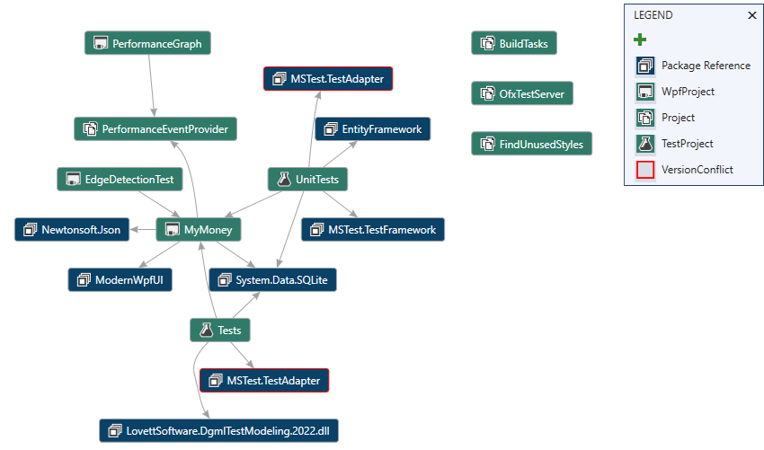

# DgmlPowerTools

DGML Power Tools is a VSIX package for Visual Studio 2019 that adds a bunch of handy new DGML related features, including neighborhood and butterfly modes, export to SVG, Drag/Drop of images, Graph Diff, and auto grouping.

See [demo video](https://lovettsoftwarestorage.blob.core.windows.net/videos/DGMLPowerTools.mp4)

# Nuget Package

See [DgmlPowerTools Nuget package ](https://marketplace.visualstudio.com/items?itemName=ChrisLovett.DgmlPowerTools2019).

# Source Code

See [https://github.com/clovett/DgmlPowerTools](https://github.com/clovett/DgmlPowerTools).

## **Graph Project Dependencies**

This handy command can be found under the VS Project menu and will produce a DGML graph showing all the project dependencies in one graph including any PackageReferences.  Combined with the neighborhood view you can easily restrict the graph to a single project you care about.  For example, the project dependencies for the  [MyMoney.Net](https://github.com/clovett/MyMoney.Net) solution look like this:

Notice that it highlights in red any package dependency version conflicts.

## **Add Dependent Assemblies**

If you drop a random .dll onto a new Directed Graph Document, you can now expand all it's dependent assemblies using this new context menu item:

## Save as SVG

You will see the "Save as SVG" command in the Share menu on the Directed Graph Document toolbar.

## Neighborhood mode

On the Directed Graph Document toolbar this command allows you to filter the graph to show only a specified number of degrees of freedom away from the selected node.  If you move the selected node, click the button again to "recenter" the neighborhood on the new selection.  To turn off neighborhood select the "Off" command inside the drop down menu next to the icon on the toolbar.

Neighborhood mode can help when you have messy graphs like this one:

In this case if you only care about one degree of freedom from the selected node then neighborhood mode will give you this nice clean subset:

## Butterfly mode

On the Directed Graph Document toolbar this command removes cycles in the graph so that you see only the tree of incoming and outgoing dependencies around the selected node.  This works nicely together with neighborhood mode.  To recompute the butterfly simply click the toolbar button again after moving the selection.  If you add butterfly mode to the above neighborhood example you get this even cleaner graph:

Notice the difference between the two graphs is that butterfly mode removed the cycles so you can see a clean picture of incoming and outgoing dependencies relative to the selected node.   Butterly also ensures that the arrows flow in the same direction which makes seeing the dependencies a lot easier.  Just note that in removing cycles there may be some missing circular dependencies which you won't discover until you move the center of the butterfly.

## Windows Drag/Drop 

Simply drag images from Windows Explorer onto the canvas so you can wire them up with links and groups and quickly create some really nice looking diagrams.

In fact you can drag any file on to the canvas to get a node with a Reference attribute pointing at that file
(which is then handy for “Goto->Reference” command).

## Graph Diff

You will see the graph compare command in the Directed Graph Document context menu:

This command compares your current graph with another and then loads the result in a new window showing what was added or removed:

## DGML Autogrouping

A new tool window that allows you to provide auto-grouping information.  If you take the [.NET Assemblies.dgml](http://www.lovettsoftware.com/dgml/demos/.net4.0/assemblies.dgml) graph for example, and add the following grouping information in the DGML Filter View then click the "Apply Groups" button in the toolbar you will see a nice grouped view of the data.

**Note**: use the number pad +/- keys to re-order the list (use TAB key to make sure list has the keyboard focus).

The following is the result when you apply this grouping information (see [grouppatterns.xml](http://www.lovettsoftware.com/dgml/demos/.net4.0/grouppatterns.xml) )) :

## **Change History**

2.0.10 Some nice improvements to package dependencies  from 'zplan'.

2.0.9 Add nuget package dependencies to project dependencies diagram (special thanks to PR from 'zplan').  Also added new "Add Dependent Assemblies" menu item on context menu.

2.0.8 Add VS 2022 version.

2.0.7 Add 'Graph Project Dependencies' under the VS Project menu.

2.0.6 Add new DGML grouping view context menu items for move up, move down, insert, delete. Add regex support to DGML grouping, regex is identified by "/.../" delimiters on the term. Fix some layout issues in DGML grouping view so that long text wraps nicely.

2.0.5 Add default file name to SVG file save as dialog

2.0.4 Fix some bugs in SVG export

2.0.3 Preserve more DGML structure, including grouping and node and link identities, in the exported SVG.

2.0.2 Fix export of "dark theme" to SVG.

2.0.1  And new context menu item "Hide internals", and fix bugs in DGML Filter View

1.8 Add support for VS 2019.

1.6 Provide GraphDiffTemplate.dgml in ~/Documents/Visual Studio 2017/DgmlPowerTools so user can customize it.

1.5 Add support for VS 2017

1.4 Add DGML Filter View for "auto-grouping" of complex graphs.

1.3 Upgrade to support VS 2013 and add butterfly mode.

1.2 Make Save As SVG show up under Share menu on new Graph Document Toolbar, if you have VS 2012 Update installed.

1.1 Fix bugs in SVG exporter

1.0 Initial version

# Build and Test

Load the solution in `DgmlPowerTools.2022\DgmlPowerTools.2022.sln` and build.
Press F5 to run the extension in the VS experimental hive.
